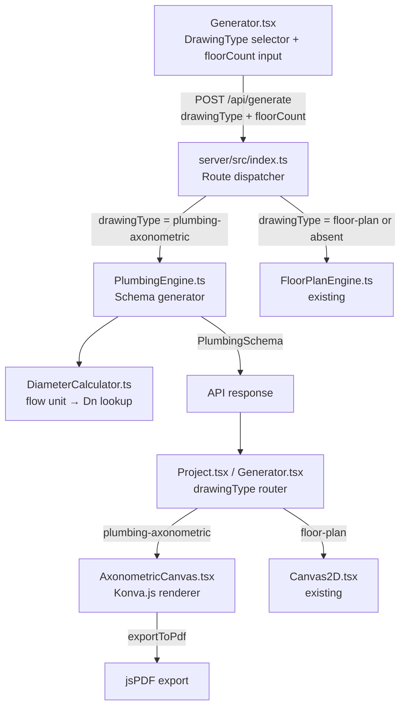

# Design Document: Plumbing Axonometric Schema

## Overview

This feature adds a second drawing type — "Suv ta'minoti aksonometrik sxemasi" (Plumbing Axonometric Schema) — to the existing Multibuilder-AI application. The system currently supports only architectural floor plans. This design extends it to generate isometric plumbing diagrams for 1–3 floor buildings, showing cold water, hot water, and drain pipe networks with automatically calculated diameters per GOST standards.

The axonometric projection uses the standard isometric convention:
- X axis: right at 30° from horizontal
- Y axis: left at 30° from horizontal  
- Z axis: straight up (vertical)
- `FLOOR_HEIGHT = 300` units (3 meters per floor)

The feature follows the existing architectural pattern: AI parses natural language → engine computes geometry → canvas renders the result.

---

## Architecture



**Key design decisions:**

1. `PlumbingEngine` is a pure function class (no state, no AI calls) — same pattern as `FloorPlanEngine`. AI only parses intent; the engine computes all coordinates.
2. `DiameterCalculator` is a standalone utility module, not a class method, so it can be unit-tested independently and reused.
3. `AxonometricCanvas` is a new Konva.js component with the same `forwardRef` + `exportToPdf` handle pattern as `Canvas2D`.
4. `DrawingType` is added to `shared/types.ts` so both client and server share the same discriminated union — no `any` types.
5. The API dispatcher in `server/src/index.ts` branches on `drawingType` before calling the appropriate engine.

---

## Components and Interfaces

### 1. `shared/types.ts` — new types

```typescript
export type DrawingType = 'floor-plan' | 'plumbing-axonometric';

export type PlumbingFixtureType = 'sink' | 'toilet' | 'bathtub' | 'shower' | 'washing_machine';

export interface PlumbingFixture {
  id: string;
  type: PlumbingFixtureType;
  floor: number;       // 0-indexed floor number
  position: Point;     // axonometric canvas coordinates
}

export interface PlumbingPipe {
  id: string;
  type: PipeType;      // reuses existing 'cold' | 'hot' | 'drain'
  path: Point[];       // axonometric canvas coordinates
  diameter: number;    // mm, e.g. 20, 25, 32, 40, 50, 100
  label: string;       // "Dn 20", "Dn 25", etc.
}

export interface PlumbingSchema {
  id: string;
  floorCount: number;
  fixtures: PlumbingFixture[];
  pipes: PlumbingPipe[];    // branch pipes
  risers: PlumbingPipe[];   // vertical riser pipes
}

// DrawingData extended (backward-compatible — both fields optional)
export interface DrawingData {
  id: string;
  walls: Wall[];
  fixtures: PlacedFixture[];
  pipes: Pipe[];
  dimensions: DimensionLine[];
  doors: DoorSpec[];
  windows?: WindowSpec[];
  drawingType?: DrawingType;        // NEW
  plumbingSchema?: PlumbingSchema;  // NEW
}
```

### 2. `server/src/engine/PlumbingEngine.ts`

```typescript
export class PlumbingEngine {
  generate(floorCount: number, description: string): PlumbingSchema
}
```

Responsibilities:
- Place standard fixture set per floor (sink, toilet, bathtub or shower)
- Compute axonometric coordinates for each fixture using `FLOOR_HEIGHT = 300`
- Compute riser paths (vertical lines at fixed x positions per pipe type)
- Compute branch paths (horizontal lines from fixture to riser)
- Call `DiameterCalculator` for all pipes and risers
- Return a complete `PlumbingSchema`

Coordinate system (canvas units, 1m = 100 units):
- Cold riser: `x = 0`
- Hot riser: `x = 50`
- Drain riser: `x = 100`
- Floor baseline: `y = floorIndex * FLOOR_HEIGHT`
- Fixtures placed at `x = 200 + fixtureIndex * 150`, `y = floorBaseline`

### 3. `server/src/engine/DiameterCalculator.ts`

```typescript
// Flow units per fixture type (l/s)
export const FLOW_UNITS: Record<PlumbingFixtureType, number> = {
  sink: 0.3, toilet: 1.6, bathtub: 0.3, shower: 0.2, washing_machine: 0.3
};

// Supply pipe diameter thresholds
export function calcSupplyDiameter(totalFlow: number): number
// Returns: ≤0.8→20, ≤1.5→25, ≤3.0→32, >3.0→40

// Drain pipe diameter thresholds
export function calcDrainDiameter(fixtureCount: number): number
// Returns: 1→50, ≥2→100

// Compute and annotate all pipes in a schema
export function annotateDiameters(schema: PlumbingSchema): PlumbingSchema
```

### 4. `client/src/components/AxonometricCanvas.tsx`

```typescript
export interface AxonometricCanvasHandle {
  exportToPdf: (filename?: string) => void;
}

interface AxonometricCanvasProps {
  schema: PlumbingSchema;
  width?: number;
}

export default forwardRef<AxonometricCanvasHandle, AxonometricCanvasProps>(
  function AxonometricCanvas(props, ref) { ... }
)
```

Rendering responsibilities:
- Draw risers as vertical lines (cold=`#c084fc`, hot=`#3b82f6`, drain=`#64748b` dashed)
- Draw branch pipes as horizontal lines with same color coding
- Draw fixture symbols as simple CAD rectangles with type labels
- Draw floor level markers (horizontal dashed lines with "X qavat" labels)
- Draw diameter labels (`"Dn XX"`) centered on each pipe segment
- Draw GOST title block (bottom-right)
- Expose `exportToPdf` via `useImperativeHandle`

### 5. `client/src/pages/Generator.tsx` — changes

- Add `drawingType` state: `'floor-plan' | 'plumbing-axonometric'`
- Add `floorCount` state (default: 1)
- Render two radio/tab buttons for drawing type selection
- Show `floorCount` selector (1–3) only when `plumbing-axonometric` is selected
- Include `drawingType` and `floorCount` in the `/api/generate` POST body
- After generation, render `AxonometricCanvas` when `drawingData.drawingType === 'plumbing-axonometric'`

### 6. `server/src/index.ts` — changes

In `/api/generate`:
```typescript
const { description, drawingType, floorCount } = req.body;

if (drawingType === 'plumbing-axonometric') {
  // Validate floorCount
  const fc = floorCount ?? 1;
  if (fc < 1 || fc > 3) return res.status(400).json({ error: 'floorCount must be 1–3' });
  const schema = plumbingEngine.generate(fc, description);
  const drawingData: DrawingData = {
    id: `plumbing-${Date.now()}`,
    walls: [], fixtures: [], pipes: [], dimensions: [], doors: [],
    drawingType: 'plumbing-axonometric',
    plumbingSchema: schema
  };
  return res.json({ drawingData });
}
// else: existing FloorPlanEngine path
```

---

## Data Models

### PlumbingSchema (runtime example, 2 floors, bathroom per floor)

```json
{
  "id": "plumbing-abc123",
  "floorCount": 2,
  "fixtures": [
    { "id": "f-0-sink",    "type": "sink",    "floor": 0, "position": { "x": 200, "y": 0   } },
    { "id": "f-0-toilet",  "type": "toilet",  "floor": 0, "position": { "x": 350, "y": 0   } },
    { "id": "f-0-shower",  "type": "shower",  "floor": 0, "position": { "x": 500, "y": 0   } },
    { "id": "f-1-sink",    "type": "sink",    "floor": 1, "position": { "x": 200, "y": 300 } },
    { "id": "f-1-toilet",  "type": "toilet",  "floor": 1, "position": { "x": 350, "y": 300 } },
    { "id": "f-1-shower",  "type": "shower",  "floor": 1, "position": { "x": 500, "y": 300 } }
  ],
  "pipes": [
    { "id": "branch-cold-0-sink", "type": "cold", "path": [{"x":200,"y":0},{"x":0,"y":0}], "diameter": 20, "label": "Dn 20" }
  ],
  "risers": [
    { "id": "riser-cold", "type": "cold", "path": [{"x":0,"y":0},{"x":0,"y":600}], "diameter": 25, "label": "Dn 25" }
  ]
}
```

### API request body

```typescript
interface GenerateRequest {
  description: string;
  drawingType?: DrawingType;   // defaults to 'floor-plan'
  floorCount?: number;         // 1–3, only used for plumbing-axonometric
}
```

### Serialization

`PlumbingSchema` is a plain JSON-serializable object (no class instances, no circular refs, no `Date` objects). `JSON.stringify` / `JSON.parse` round-trips are lossless. The existing Supabase `drawing_data` JSONB column stores the full `DrawingData` including the embedded `plumbingSchema`.

---

## Correctness Properties

*A property is a characteristic or behavior that should hold true across all valid executions of a system — essentially, a formal statement about what the system should do. Properties serve as the bridge between human-readable specifications and machine-verifiable correctness guarantees.*

### Property 1: DrawingType is always forwarded in API requests

*For any* drawing type selection in the Generator UI, the POST body sent to `/api/generate` must contain a `drawingType` field equal to the selected value.

**Validates: Requirements 1.4**

---

### Property 2: Flow unit lookup is correct for all fixture types

*For any* fixture type in `{ sink, toilet, bathtub, shower, washing_machine }`, `FLOW_UNITS[type]` must return the exact value specified in the requirements (sink=0.3, toilet=1.6, bathtub=0.3, shower=0.2, washing_machine=0.3).

**Validates: Requirements 3.1**

---

### Property 3: Supply diameter thresholds are monotone

*For any* total flow value `q ≥ 0`, `calcSupplyDiameter(q)` must return a diameter from `{20, 25, 32, 40}` and the result must be non-decreasing as `q` increases (i.e., `q1 ≤ q2 → calcSupplyDiameter(q1) ≤ calcSupplyDiameter(q2)`).

**Validates: Requirements 3.2**

---

### Property 4: Branch diameter depends only on its own fixtures

*For any* two disjoint fixture lists `A` and `B`, `calcSupplyDiameter(totalFlow(A))` must be independent of the contents of `B`. Adding fixtures to `B` must not change the diameter computed for `A`.

**Validates: Requirements 3.3**

---

### Property 5: Drain diameter threshold rule

*For any* fixture count `n ≥ 1`, `calcDrainDiameter(n)` must return 50 when `n = 1` and 100 when `n ≥ 2`.

**Validates: Requirements 3.4**

---

### Property 6: All pipes have "Dn XX" formatted labels after annotation

*For any* `PlumbingSchema` passed through `annotateDiameters`, every pipe and riser in the result must have a `label` field matching the regex `/^Dn \d+$/`.

**Validates: Requirements 3.5, 4.7**

---

### Property 7: Schema generation produces correct floor count

*For any* `floorCount` N in `{1, 2, 3}`, `PlumbingEngine.generate(N, description)` must return a `PlumbingSchema` where the set of distinct `fixture.floor` values equals `{0, 1, ..., N-1}`.

**Validates: Requirements 4.1, 4.2**

---

### Property 8: Riser y-coordinates follow FLOOR_HEIGHT invariant

*For any* generated `PlumbingSchema` with `floorCount` N, each riser's path must span from `y = 0` to `y = N * FLOOR_HEIGHT` (where `FLOOR_HEIGHT = 300`), and each floor's fixture `y` coordinate must equal `floor * FLOOR_HEIGHT`.

**Validates: Requirements 4.3**

---

### Property 9: Every fixture has a branch pipe

*For any* generated `PlumbingSchema`, for every fixture in `schema.fixtures`, there must exist at least one pipe in `schema.pipes` whose path connects the fixture's position to a riser.

**Validates: Requirements 4.4**

---

### Property 10: Three riser types are always present

*For any* generated `PlumbingSchema` with `floorCount ≥ 1`, `schema.risers` must contain exactly one riser of each type: `cold`, `hot`, and `drain`.

**Validates: Requirements 4.5**

---

### Property 11: Pipe color matches pipe type

*For any* `PlumbingPipe` rendered by `AxonometricCanvas`, the Konva stroke color must equal `#c084fc` for `cold`, `#3b82f6` for `hot`, and `#64748b` for `drain`.

**Validates: Requirements 5.2, 5.3, 5.4**

---

### Property 12: Diameter labels are rendered for all pipes

*For any* `PlumbingSchema` rendered by `AxonometricCanvas`, every pipe and riser with a non-empty `label` must produce a `Konva.Text` node whose text equals that label.

**Validates: Requirements 5.5**

---

### Property 13: API routing by drawingType

*For any* request to `/api/generate`, if `drawingType = 'plumbing-axonometric'` then the response must contain `drawingData.plumbingSchema`; if `drawingType = 'floor-plan'` or absent, the response must contain `drawingData.walls`.

**Validates: Requirements 6.1, 6.2**

---

### Property 14: floorCount validation rejects out-of-range values

*For any* `floorCount` value outside `[1, 3]` (e.g., 0, 4, -1, 100), the `/api/generate` endpoint must return HTTP 400.

**Validates: Requirements 6.4**

---

### Property 15: PlumbingSchema JSON round-trip

*For any* valid `PlumbingSchema` object, `JSON.parse(JSON.stringify(schema))` must produce a value deeply equal to the original schema (all fields, all nested arrays, all numeric values preserved).

**Validates: Requirements 7.3**

---

### Property 16: Invalid JSON deserialization returns descriptive error

*For any* string that is not valid JSON or does not conform to the `PlumbingSchema` shape, the deserialization function must throw or return an error object containing a human-readable message (non-empty string).

**Validates: Requirements 7.4**

---

### Property 17: Canvas component routing by drawingType

*For any* `DrawingData` with `drawingType = 'plumbing-axonometric'`, the Project page must render `AxonometricCanvas`; for `drawingType = 'floor-plan'` or absent, it must render `Canvas2D`.

**Validates: Requirements 8.2**

---

## Error Handling

| Scenario | Location | Behavior |
|---|---|---|
| `floorCount` out of range | `server/src/index.ts` | Return `400 Bad Request` with `{ error: 'floorCount must be 1–3' }` |
| `drawingType` unknown value | `server/src/index.ts` | Fall through to floor-plan path (safe default) |
| `PlumbingSchema` missing from `DrawingData` | `AxonometricCanvas` | Render empty canvas with "Ma'lumot yo'q" message |
| `JSON.parse` failure on load | `Project.tsx` | Existing error boundary catches it; show error state |
| `floorCount` not provided for plumbing | `PlumbingEngine` | Default to 1 |
| Fixture type not in `FLOW_UNITS` | `DiameterCalculator` | Default flow unit = 0.3 l/s (conservative) |

---

## Testing Strategy

### Dual Testing Approach

Both unit tests and property-based tests are required. Unit tests cover specific examples and integration points; property tests verify universal correctness across all inputs.

### Unit Tests

Location: `server/src/engine/__tests__/PlumbingEngine.test.ts`, `server/src/engine/__tests__/DiameterCalculator.test.ts`

- `PlumbingEngine.generate(1, ...)` produces a schema with 3 fixtures on floor 0
- `PlumbingEngine.generate(3, ...)` produces fixtures on floors 0, 1, 2
- `DiameterCalculator.calcSupplyDiameter(0.5)` returns 20
- `DiameterCalculator.calcDrainDiameter(1)` returns 50
- `DiameterCalculator.calcDrainDiameter(2)` returns 100
- `annotateDiameters` sets label on every pipe
- API returns 400 for `floorCount = 0`
- API returns 400 for `floorCount = 4`
- Boiler room fixtures are excluded from schema (Requirement 4.6)
- `JSON.parse(JSON.stringify(schema))` deep-equals original (round-trip example)

### Property-Based Tests

Library: **fast-check** (already available in the Node.js ecosystem; add to `server/package.json` devDependencies)

Location: `server/src/engine/__tests__/PlumbingEngine.property.test.ts`

Configuration: minimum **100 iterations** per property (fast-check default is 100).

Each test is tagged with a comment referencing the design property:

```typescript
// Feature: plumbing-axonometric-schema, Property 3: Supply diameter thresholds are monotone
it('calcSupplyDiameter is non-decreasing', () => {
  fc.assert(fc.property(
    fc.float({ min: 0, max: 10 }),
    fc.float({ min: 0, max: 10 }),
    (q1, q2) => {
      const [lo, hi] = q1 <= q2 ? [q1, q2] : [q2, q1];
      return calcSupplyDiameter(lo) <= calcSupplyDiameter(hi);
    }
  ), { numRuns: 100 });
});
```

Property tests to implement (one test per property):

| Test | Property | Generator |
|---|---|---|
| Flow unit lookup | Property 2 | `fc.constantFrom('sink','toilet','bathtub','shower','washing_machine')` |
| Supply diameter monotone | Property 3 | `fc.float({ min: 0, max: 20 })` pairs |
| Branch isolation | Property 4 | Two independent `fc.array(fc.constantFrom(...))` |
| Drain diameter threshold | Property 5 | `fc.integer({ min: 1, max: 20 })` |
| Label format | Property 6 | `fc.integer({ min: 1, max: 3 })` → generate schema |
| Floor count invariant | Property 7 | `fc.integer({ min: 1, max: 3 })` |
| FLOOR_HEIGHT invariant | Property 8 | `fc.integer({ min: 1, max: 3 })` |
| Branch per fixture | Property 9 | `fc.integer({ min: 1, max: 3 })` |
| Three riser types | Property 10 | `fc.integer({ min: 1, max: 3 })` |
| floorCount validation | Property 14 | `fc.oneof(fc.integer({ max: 0 }), fc.integer({ min: 4 }))` |
| JSON round-trip | Property 15 | `fc.integer({ min: 1, max: 3 })` → generate schema |

### Client-Side Tests

Location: `client/src/components/__tests__/AxonometricCanvas.test.tsx`

- Pipe color mapping (Properties 11, 12) — render with mock schema, assert Konva node attributes
- Canvas routing in Project.tsx (Property 17) — render with `drawingType='plumbing-axonometric'`, assert `AxonometricCanvas` is mounted
- Generator UI shows drawing type selector (Requirement 1.1) — example test
- Generator UI shows floorCount input only for plumbing type (Requirement 1.2) — example test
